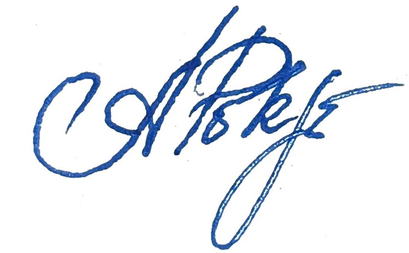

[[cover-letter]]

[%nonfacing]
[%notitle]
ifdef::all[== Bewerbung]

[cols=2,frame=none,grid=cols]
|===
|

{empty} +
{empty} +
{empty} +
[.txt-sml.fgray]#Oleksii Pokrovskyi, Windthorst Str. 15, 67346 Speyer#

DIS AG Mannheim +
Harrlachweg 6 +
68163 Mannheim +
Deutschland +

|[.head-h1.fblue]#Oleksii Pokrovskyi#

[.fgray]#Kontaktdaten# +
0170 2884753 +
alex.pokrowskiy@gmail.com 

[.fgray]#Adresse# +  
Oleksii Pokrovskyi +
Windthorst Str. 15 +
67346 Speyer 

|===

[.txt-right]
Speyer, {revdate} 

[.head-h2.fblue]
Bewerbung als DevOps Developer (m/w/d) +
Referenz-Nr.: JN -042026-1021552

Sehr geehrter Herr Senay,

Ihre Stellenanzeige für die Position als DevOps Developer in Speyer hat mich sofort sehr angesprochen. Da ich selbst in Speyer wohne und langjährige Erfahrung in der IT mitbringe, freue ich mich sehr über die Möglichkeit, mich Ihnen vorzustellen.

Ich arbeite seit fast 20 Jahren als Softwareentwickler. In meinen letzten Projekten habe ich intensiv mit modernen Cloud-Technologien, Linux, Docker, Kubernetes, CI/CD-Pipelines (wie GitLab) und Azure gearbeitet. Es macht mir viel Freude, Infrastrukturen aufzubauen, Anwendungen zuverlässig zu betreiben und Entwicklungsprozesse optimal zu unterstützen.

Da ich in Deutschland einen neuen Lebensabschnitt beginne, suche ich vor allem eine gute Möglichkeit für meinen beruflichen Einstieg hier vor Ort. Mir ist es sehr wichtig, wertvolle praktische Berufserfahrung in einem deutschen Arbeitsumfeld zu sammeln und mich langfristig im Team einzubringen. Das Gehalt steht für mich dabei nicht an erster Stelle; viel wichtiger sind mir spannende Aufgaben, ein stabiles Umfeld und die Chance, mich fachlich zu beweisen.

Ich spreche fließend Englisch und lerne intensiv Deutsch (aktuell auf dem Niveau B1). Durch meine langjährige Arbeit in internationalen Teams bin ich es gewohnt, mich schnell und problemlos in neue Arbeitsgruppen einzufügen.

Über die Gelegenheit, mich Ihnen in einem persönlichen Gespräch vorzustellen, freue ich mich sehr.

[%unbreakable] 
--
Mit freundlichen Grüßen aus Speyer 

:figure-caption!:
.Oleksii Pokrovskyi

--
