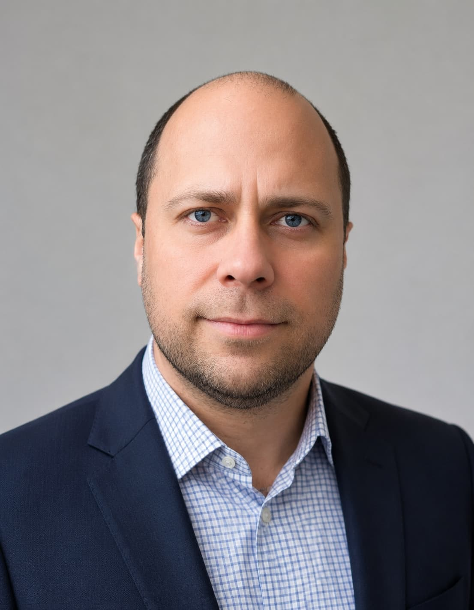

[[curriculum-vitae]]

[%nonfacing]
[%notitle]
ifdef::all[== Lebenslauf]

[width=70%,align=right,cols=1,frame=none,grid=rows]
|===
|[.head-h1.fblue]#Oleksii Pokrovskyi#
|
|===

[cols="6,2",frame=none,grid=rows]
|===
a|

[align=left,cols=">3,6",frame=none,grid=none]
!===
![.fgray]#Kontaktdaten# 
!
0170 2884753 +
alex.pokrowskiy@gmail.com +
https://wa.me/qr/QKHRAB5ZAMIUK1[WhatsApp] +
https://www.linkedin.com/in/alex-pokrowskiy[LinkedIn] +
![.fgray]#Adresse# 
!
Oleksii Pokrovskyi +
Windthorst Str. 15 +
67346 Speyer +
![.fgray]#Geburtsdatum und -ort# 
!
30.01.1986 in Oleksandrija
![.fgray]#Nationalität# 
!
Ukrainisch
!===

a|

|===

// {empty} +

[width=70%,align=right,cols=1,frame=none,grid=rows]
|===
|[.head-h2.fblue]#Beruflicher Werdegang#
|
|===

[align=left,cols=">3,8",frame=none,grid=none]
|===
|[.fgray]#12/2024 - laufend#
|aktive Arbeitssuche 
|[.fgray]#2024#
|Einreise nach Deutschland
|[.fgray]#03/2017 – 07/2024#
a|
*Fullstack/ Dotnet Developer*, GlobalLogic, Kiew, Ukraine
[disc]
* Projektmitarbeiter 
* NET Software Engineering 
* 2,5 Jahre Einsatz in der Niederlassung in Boston, USA 
|[.fgray]#06/2014 - 09/2016#
a|
*Fullstack Developer*, Kraftek, Kiew, Ukraine
[disc]
* Projektentwickler
* DotNet Software Engeneering
|[.fgray]#11/2009 - 06/2014#
a|
*Application/ System Developer*, TAS-Pharma, Kiew, Ukraine
[disc]
* Projektentwickler
* System Engineering
|[.fgray]#01/2008 - 11/2009#
a|
*System Engineer*, TERNOPHARMA, Kiew, Ukraine
[disc]
* Unterstützung von Datenanalysen in verschiedenen Systemen
|===

// {empty} +

[width=70%,align=right,cols=1,frame=none,grid=rows]
|===
|[.head-h2.fblue]#Ausbildung, Spracherwerb#
|
|===

[align=left,cols=">3,8",frame=none,grid=none]
|===
|[.fgray]#09/2005 – 05/2008#
a|
IT Studium, NAU (national Aviation University), Kiew, Ukraine 
[disc]
* *Abschluss: Bachelor*
* Schwerpunkt: Anwendungsprogrammierung
|[.fgray]#09/2001 - 05/2005#
a|
IT Studium, OIT (Oleksandrija Polytechnic College), Oleksandrija, Ukraine
[disc]
* *Abschluss: Junior Specialist*
* Schwerpunkt: Mathematische Programmierung
|[.fgray]#09/1993– 05/2001#
a|
Schulbildung, Oleksandrija, Ukraine
[disc]
* *Abschluss: Abitur*
|[.fgray]#04/2025 - 12/2025#
a|
Deutschkurs, VHS Speyer
[disc]
* *Abschluss: B1 Prüfung*
|===

// {empty} +

[width=70%,align=right,cols=1,frame=none,grid=rows]
|===
|[.head-h2.fblue]#Sprachen#
|
|===

[align=left,cols=">3,8",frame=none,grid=none]
|===
|[.fgray]#Deutsch#
|B1 Niveau
|[.fgray]#Englisch#
|Verhandlungssicher
|[.fgray]#Ukrainisch/ Russisch#
|Muttersprachen
|===

// {empty} +

ifdef::pr[include::technical-skills.adoc[]]

ifdef::pr[include::projekt-erfahrungen.adoc[]]

ifdef::pr[include::weitere-kompetenzen.adoc[]]

[width=70%,align=right,cols=1,frame=none,grid=rows]
|===
|[.head-h2.fblue]#Weitere Kompetenzen#
|
|===

[align=left,cols=">3,8",frame=none,grid=none]
|===
|[.fgray]#Meine Stärken#
|Zielgerichtetes Handeln und Denken, Problemlösungsfähigkeit, analytisches Denken, Teamfähigkeit, technisches Verständnis, Kommunikationsfähigkeit, unternehmerisches Denken
|[.fgray]#Führerschein#
|Klasse B, eigener Pkw vorhanden
|===

{empty} +

[%unbreakable] 
--
:figure-caption!:
.Oleksii Pokrovskyi
image::sign.jpg[Sign,125,float=left]
[.txt-right]
Speyer, {revdate} 
--
